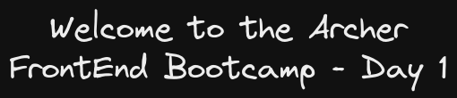

# FrontEnd Bootcamp

# Welcome to Day 1

## **Intro to Webdev**

## Resources:

- VS Code: https://code.visualstudio.com/
- Getting started with HTML: https://developer.mozilla.org/en-US/docs/Learn/Getting_started_with_the_web/HTML_basics

### Roadmap

- 1: Web Development
- 2: DevTools
- 3: Google Developer Tools (basic intro)
- 4: Open the developers tools
- 5: Explain the tabs in the developer tools
- 6: Anatomy of an HTML element
- 7: HTML Tags

#### 1. Web Development

User facing part of an application:

- Client, Frontend, Browser
- HTML, CSS, JavaScript

Middle:

- request, response

#### Backend

- Server: request, response, database
- Server: NodeJS, ASP.NET, Java, ROR Ruby on rails
- Database: SQL, MySQL, MongoDB

#### FrontEnd

HTML:

- Allows us to structure the document using markup
- markups: elements or tags

CSS:

- Allows us to style the website
  - Change the spacing
  - Modify the colors
  - Determine how to place elements

JS:

- Allows us to add interactivity and respond to user actions or events

#### 2. DevTools

- VSCode, Google Chrome Browser

#### 3. Google Developer Tools (basic intro)

- Read the HTML tree
- Read and edit CSS styles
- View network connections

#### 4. Open the developers tools

#### 5. Explain the tabs in the developer tools

#### 6. Anatomy of an HTML element

```
element: <h1>content</h1>

<h1> <--[opening tag]
content goes here <--[content]
</h1> <--[closing tag]
```

#### 7. HTML Tags

- `` img tag has no content, some tags has no content
- `` the src inside the tag is an attribute
- `` some tags are self-closing
