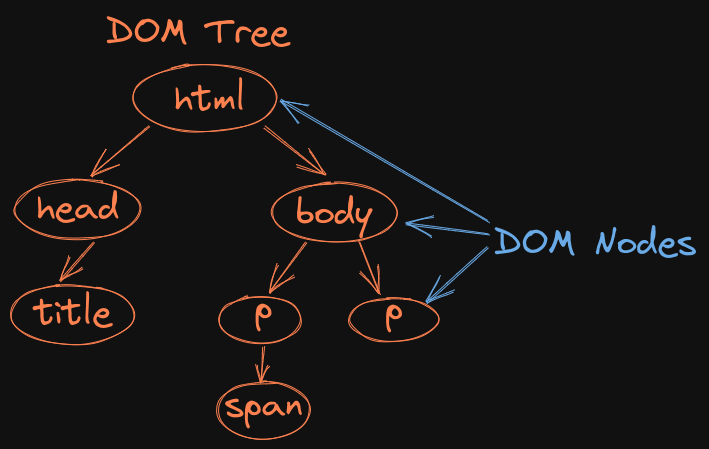

# Welcome to Day 4

## **JS: Functions & DOM**

## Resources:

- Functions: https://www.w3schools.com/js/js_functions.asp
- Common DOM Methods: https://developer.mozilla.org/en-US/docs/Web/API/Document_Object_Model/Introduction#core_interfaces_in_the_dom

### Roadmap

- 1: file 1
- 2: file 2: DOM API Examples
- 3: Portfolio

#### 1. file 1

#### 2. file 2: DOM API Examples

- Explain the DOM tree structure 
- Inside the browser devtools, select a paragraph in the elements tab, then open the properties tab that is in the same menu as styles, computed, layout, etc
- An HTML element is represented as an object when a DOM node is created, also all the styling associated with it, styles tab
- Properties has an object with all the properties of the paragraph HTML element
- Filter the paragraph id: `
this is the first paragraph
`, searching the word, id in the properties tab
- The browser allows us to access DOM node usingan API
- Explain t what is an API: APIs are functions which are provided by an external entity or are external to the program which we have written outselves
- DOM interface provided by the browser for us to call these functions

#### 3. Portfolio