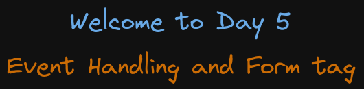

# Welcome to Day 5

## **Event Handling and Form tag**

## Resources:

- Intro to events: https://developer.mozilla.org/en-US/docs/Learn/JavaScript/Building_blocks/Events
- Event types: https://developer.mozilla.org/en-US/docs/Web/Events#event_listing
- Input tag: https://developer.mozilla.org/en-US/docs/Web/HTML/Element/input
- Form tag: https://developer.mozilla.org/en-US/docs/Web/HTML/Element/form#attr-action
- Form Validation: https://developer.mozilla.org/en-US/docs/Learn/Forms/Form_validation
- Netlify static site deployment: https://docs.netlify.com/site-deploys/create-deploys/#drag-and-drop
- Netlify forms: https://docs.netlify.com/forms/setup/

### Roadmap

- 1: Intro to events
- 2: JS at the top level in html file ERROR
- 3: Form tag
- 4: Debugg a file
- 5: Deploy portfolio to Netlify link: https://elfgodd-portfolio.netlify.app/

#### 1. Intro to events

```html
<button onClick="handleClick()">Click Me</button>

<script>
  function handleClick() {
    alert('You have clicked the button')
  }
</script>
```

Prevent the default behavior of an event with `event.preventDefault()`

#### 2. JS at the top level in html file ERROR

The DOM nodes are created when the page is loaded. The script tag is added before the elements, the elements does not exist at the time the script tag is executed. Thats why we move the script tag to the bottom of the file

Using the DOMContentLoaded event the browser informs us that all elements have been loaded
and the content is now ready and it is visible on the screen

```javascript
// check the document.addEventListener('load') EVENT
document.addEventListener('DOMContentLoaded', function () {
  // Code of the file goes here
})
```

#### 3. Form tag

Form tags allows us to do submit some user information, or rather we are able to collect some information, certain fields, and submit or post that information to a server, or send some data from the client side to the backend.

`method="post"` The method by default is a GET request

#### 4. Debugg a file

Running the form.js & form.html with live server, open the Devtools console, go to the Page tab and open the forms.js file and add some breaking points

#### 5. Deploy portfolio to Netlify 

- link: https://elfgodd-portfolio.netlify.app/
- Test the form submission of netlify with a temporary email: https://temp-mail.org

