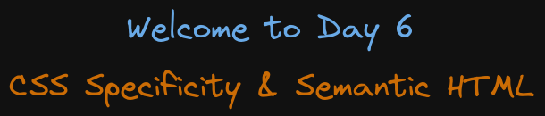

# Welcome to Day 6

## **CSS Specificity & Semantic HTML**

## Resources:

- CSS Specificity: https://www.w3schools.com/css/css_specificity.asp
- Semantic HTML: https://www.w3schools.com/html/html5_semantic_elements.asp
- Pseudo classes: https://developer.mozilla.org/en-US/docs/Web/CSS/Pseudo-classes
- Pseudo elements: https://developer.mozilla.org/en-US/docs/Web/CSS/Pseudo-elements
- Position elements: https://developer.mozilla.org/en-US/docs/Web/CSS/position
- Positioning Elements: https://css-tricks.com/absolute-relative-fixed-positioining-how-do-they-differ/

### Roadmap

- 1: Specificity
- 2: Box sizing
- 3: Semantic tags
- 4: Colors
- 5: pseudo-element
- 6: Border VS Outline
- 7: CSS positioning style file 02 & 03
- 8: z-index

#### 1. Specificity

- By default the browser has a user agent style sheet
- inline styling is top 1 in specificity
- id styling is top 2 in specificity
- class styling is top 3 in specificity
- element is the last one in specificity
- overridding an !important with another !important besides it
- the rule which is coming later on will take precedence, if there are two fules which have the same specificity

#### Order of CSS specificity

1. inline style
2. id
3. class
4. element selector

#### 2. Box sizing

Box-sizing in CSS determines how the width and height of an element are calculated. By default, it includes only the content, but with box-sizing: border-box;, padding and borders are included in the element's total size, preventing layout issues.

#### 3. Semantic tags

Semantic HTML tags provide meaning to the web page content, making it easier for browsers and search engines to understand the structure. Here are the top 10 to 20 semantic tags commonly used in HTML:

`<header>`: Represents the header section of a document or a section.
`<nav>`: Defines a navigation menu or set of navigation links.
`<main>`: Specifies the main content of the document, unique to the page's central purpose.
`<section>`: Groups related content together, often used for thematic sections.
`<article>`: Represents self-contained content that can be independently distributed or reused (e.g., blog posts).
`<aside>`: Contains content that is tangentially related to the main content (like sidebars or callouts).
`<footer>`: Defines the footer for a document or a section, often containing copyright info or links.
`<h1> to <h6>`: Heading tags that denote the structure of content, with `<h1>` being the most important.
`<figure>`: Represents self-contained content, often with media, like images, illustrations, diagrams, or code.
`<figcaption>`: Provides a caption or description for the `<figure>` element.
`<time>`: Represents a specific time or date, useful for events or timestamps.
`<mark>`: Highlights or marks text for reference or emphasis.
`<summary>`: Used as a summary or caption for the details element.
`<details>`: Creates a widget that users can open and close to reveal additional information.
`<address>`: Provides contact information for a person, business, or organization.
`<em>`: Indicates emphasis on text, usually rendered in italics.
`<strong>`: Indicates importance or strong emphasis, usually rendered in bold.
`<blockquote>`: For quoting large sections of text from another source.
`<code>`: Represents a fragment of computer code.
`<cite>`: Used to reference the title of a creative work, such as books, articles, or songs.
These semantic tags not only improve accessibility but also help search engines understand the content better, making the web page more SEO-friendly.

#### 4. Colors

- color: hex format #ffffff , 0 to 9 and alphabets from a to f
- color: rgb(0, 255, 11); // red, green blue
- color: hsl(105deg 58% 19%); // hue, saturation and lightness
- color: hsl(105deg 58% 19% / 1); // with opacity 1 dark, 0.5, 0 transparent
- colorhsl(96,0,148,100%); // using commas

#### 5. pseudo-element

A pseudo-element in web development, like ::after, creates a virtual element in the DOM, allowing you to style or insert content without altering the HTML structure.

Pseudo-element (p::after): Creates a virtual or "extra" element that is not present in the HTML but is generated by CSS. This element is placed after or before the content of the specified element (p tag in this case) and allows you to add extra content or decorative styling.

```css
p::after {
  content: 'diamonds';
  color: indianred;
  /* border: 1px solid; */
}
```

#### 6. Border VS Outline

Border is part of an element's box model and affects layout, while outline doesn't. Outline highlights elements (like inputs) on focus but doesn't impact the element's size or position.

```html
<!-- Button with border -->
<button style="border: 2px solid blue;">Button with Border</button>

<!-- Button with outline -->
<button style="outline: 2px solid red;">Button with Outline</button>

```

#### 7. CSS positioning style

Static:

The default position for elements. It follows the normal document flow, and positioning properties like top, left have no effect.
Relative:

Positioned relative to its original location. It moves according to top, left, etc., but still takes up space in the document flow.
Absolute:

Positioned relative to the nearest ancestor with a position (other than static). Removed from the document flow, so it doesn't affect other elements.
Fixed:

Always positioned relative to the viewport. Stays in the same place even when scrolling, and doesn’t occupy space in the document flow.
Sticky:

Acts like a relative element until it reaches a specified scroll point, then "sticks" in place like a fixed element while staying within its container.

#### 8. z-index

The z-index controls the stacking order of positioned elements on a webpage. Higher values appear above lower ones. It only works on elements with position properties like relative, absolute, or fixed.