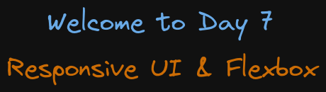

# Welcome to Day 7

## **Responsive UI & Flexbox**

## Resources:

- Media Queries: https://web.dev/learn/design/media-queries/
- At Rule: https://developer.mozilla.org/en-US/docs/Web/CSS/At-rule
- Responsive Images: https://web.dev/learn/design/responsive-images/
- Flexbox: https://css-tricks.com/snippets/css/a-guide-to-flexbox/
- Flexbox Froggy: https://flexboxfroggy.com/
- Animations: https://web.dev/learn/css/animations/

### Roadmap

- 1: Media queries file 01
- 2: transform file 02
- 3: transition file 03
- 4: animations file 04
- 5: Flexbox file 03
- 6:
- 7:
- 8:

#### 1. Media queries

Media queries allow you to create different layouts and styles for your website based on the screen size, resolution, and orientation of the device viewing it. This ensures your website looks and functions optimally on various devices, from smartphones to desktops.

Media types: print, screen, all

Rendering: To open the print mode: in the Devtools toolbar, press ctrl + shift + p and search for rendering, select Show rendering. Then on Emulate CSS media type select print or screen

#### 2. transform

The CSS transform property lets you visually manipulate elements by rotating, scaling, translating, or skewing them, creating dynamic effects without altering the document's layout.
You can apply multiple transformations to the same element

#### 3. transition

The CSS transition function controls how property changes occur, specifying duration, delay, and easing effects for smoother animations.

#### 4. animations

CSS animation functions create complex visual effects by defining keyframes, durations, and timing, allowing elements to change styles smoothly over specified intervals.
