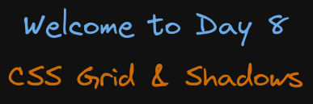

# Welcome to Day 8

## **CSS Grid & Shadows**

## Resources:

- CSS Grid: https://web.dev/learn/css/grid/
- Shadows: https://www.w3schools.com/css/css3_shadows.asp

### Extra resources:

- grid: https://developer.mozilla.org/en-US/docs/Web/CSS/grid

### Roadmap

- 1: simple grid file 01
- 2: intrinsic-values 02
- 3:
- 4:
- 5:
- 6:
- 7:

#### 1. grid

CSS Grid is a layout system that arranges elements in rows and columns, providing control over sizing, positioning, and alignment of items within a two-dimensional grid structure.

##### CSS Grid VS Flexbox

CSS Grid is best for creating two-dimensional layouts (rows and columns), while Flexbox is ideal for one-dimensional layouts (either row or column). Grid offers more control over both axes, while Flexbox focuses on content alignment along a single axis. Flexbox is more suited for smaller components within a layout, and Grid is better for the overall structure.

Grid UI: Open the Devtools UI, press ctrl + shift + p and search for rendering, select Show rendering. Then on Emulate CSS media type select print or screen

Grid UI 01: in the Devtools toolbar, in the Elements tab next to the `
` you will see a grid pill icon click on it to show grid details in the website

Grid UI 02: in the Devtools toolbar, in the Elements tab select the `
 you will see in the Styles tab inside the .container class, next to displa: grid an small icon press it to open the grid ui

Grid UI 03: in the Devtools toolbar, in the Elements tab select the `
 you will see in the Layout tab with all the information you can add or remove about the grid ui

#### 2. intrinsic-values

#### 3. raction

#### 4. minmax

#### 5. shadows

#### 6. portfolio
