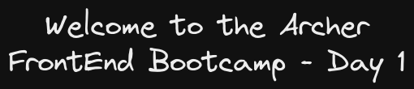

## **Welcome to the Archer FrontEnd Bootcamp - Day 1**

## 1. Web Development

User facing part of an application:

- Client, Frontend, Browser
- Examples: HTML, CSS, JavaScript

Data

- Request, Response

Backend:

- Server, Database
- Examples Server: NodeJS, ASP.NET, Java, Rails
- Examples Database: SQL, MySQL, MongoDB

## 2. FrontEnd

HTML:

- Allows us to structure the document using markup

CSS:

- Allows us to style the website
  - Change the spacing
  - Modify the colors
  - Determine how to place elements

JS:

- Allows us to add interactivity and respond to user actions

## 3. DevTools

- VSCode, Browser Google Chrome

## 4. Anatomy of an HTML element

`<h1>Welcome to the first day of the bootcamp</h1>`

`- <h1> opening tag`  
`- The text is the content`  
`- </h1> closing tag`

## 5. Google Developer Tools (basic intro)

- Read the HTML tree
- Read and edit CSS styles
- View network connections

## 6. Resources:

- VS Code: https://developer.mozilla.org/en-US/docs/Learn/Getting_started_with_the_web/HTML_basics
- Getting started with HTML: https://code.visualstudio.com/
