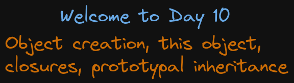

# Welcome to Day 10

## **Object creation, this object, closures, prototypal inheritance**

## 1. Files Order

- first:

## Resources:

- Prototypal inheritance: https://javascript.info/prototype-inheritance
- Prototypal inheritance 2: https://developer.mozilla.org/en-US/docs/Web/JavaScript/Inheritance_and_the_prototype_chain#inheritance_with_the_prototype_chain
- Default params: https://developer.mozilla.org/en-US/docs/Web/JavaScript/Reference/Functions/Default_parameters
- Object creation: https://www.freecodecamp.org/news/a-complete-guide-to-creating-objects-in-javascript-b0e2450655e8/
- Closure: https://developer.mozilla.org/en-US/docs/Web/JavaScript/Closures#closure
- Window object: https://developer.mozilla.org/en-US/docs/Web/API/Window
