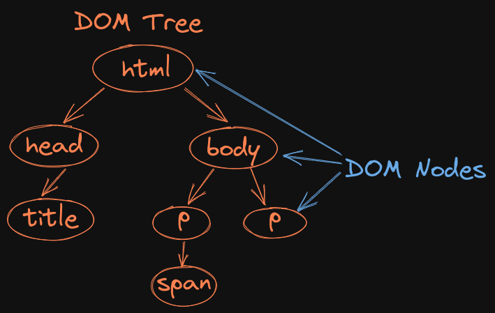

# Welcome to Day 4

## **JS: Functions & DOM**

## 1. Files Order

- first: index.html main.js
- second: dom-api-examples.js
- third: portfolio-dom

## 2. DOM Nodes

## 3. Browser API

- window, document

## 4.

- document.getElementsByClassName("blue") // returns de first object with class blue
- document.getElementsByClassName("blue")[0].className // returns first class with class blue

## Resources:

- Functions: https://www.w3schools.com/js/js_functions.asp
- Common DOM Methods: https://developer.mozilla.org/en-US/docs/Web/API/Document_Object_Model/Introduction#core_interfaces_in_the_dom
