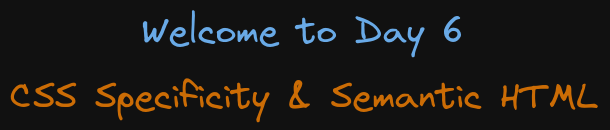

# Welcome to Day 6

## **CSS Specificity & Semantic HTML**

## 1. Files Order

- first: 01
- second: 02
- third: portfolio-semantic

## 2. Order of CSS specificity

1. inline style
2. id
3. class
4. element selector

## 3. Colors

- color: rgb(0, 255, 11); // red, green blue
- color: hsl(105deg 58% 19%); // hue, saturation and lightness
- color: hsl(105deg 58% 19% / 1); // with opacity 1 dark, 0.5, 0 transparent
- color: hsl(96,0,148,100%); // using commas

## Resources:

- CSS Specificity: https://www.w3schools.com/css/css_specificity.asp
- Semantic HTML: https://www.w3schools.com/html/html5_semantic_elements.asp
- Pseudo classes: https://developer.mozilla.org/en-US/docs/Web/CSS/Pseudo-classes
- Pseudo elements: https://developer.mozilla.org/en-US/docs/Web/CSS/Pseudo-elements
- Position elements: https://developer.mozilla.org/en-US/docs/Web/CSS/position
- Positioning Elements: https://css-tricks.com/absolute-relative-fixed-positioining-how-do-they-differ/
